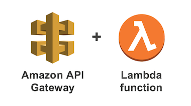

# Covid-19 (Lambda Serverless Approach)

You may view the application by following the link below:

> [Medical Information Site](http://virus19.s3-website-ap-southeast-2.amazonaws.com/)

### Synopsis
The intention of this program is to allow users to connect via the web and retrieve daily statistical information on the 
**Covid-19** pandemic.
 
The application presents a summary of the disease activity, based on location. The information includes 
critical patients, daily deltas as well as the deaths caused by the disease over the recent period. A user may click upon a region to display a graph of the last month of activity.

Users may also sign-up for a newsletter which they will be sent via email, or they may opt to receive SMS notifications. 

### Technical Details


This branch provides an adaption of the main development thread. The important change, is that rather than using a Jetty container to service requests 24/7, it makes use of the **Lambda & Serverless** architecture. 

The advantage of this is scalability, simplicity and **significant** cost reduction.

This program was written as a Java 1.8 Spring Boot microservice, using the AWS Lambda adaption as explained [Here](https://github.com/awslabs/aws-serverless-java-container/wiki/Quick-start---Spring-Boot2). As a result of these changes, webflux, the spring boot actuator, swagger and indeed the tomcat/jetty container have all been removed. 
Disease information is provided via Restful web services, through [Rapid API](https://rapidapi.com).  

The front end of the application was written using **React JS** ([React Hooks](https://reactjs.org/docs/hooks-intro.html))
together with front end HTML/CSS styling via [Bootstrap](https://getbootstrap.com). This front end sits within an AWS s3 static web container.
 
 ### How to deploy the Application to AWS
 You must have the following to run this application:
 - Java 1.8 compiler 
 - Apache maven 3 
 - An AWS account (available for free)
 - aws cli
 - node and ndm 
 
 Then perform the following:
 ```
 1. First, create an s3 bucket to store your static website:

 aws s3api create-bucket --bucket <BUCKET NAME> --acl public-read
 aws s3 website s3://<BUCKET NAME> --index-document index.html
 {
   "Version": "2012-10-17",
   "Statement": [
     {
       "Sid": "PublicReadForGetBucketObjects",
       "Effect": "Allow",
       "Principal": "*",
       "Action": "s3:GetObject",
       "Resource": "arn:aws:s3:::<BUCKET NAME>/*"
     }
   ]
 }
 aws s3api put-bucket-policy --bucket <BUCKET NAME> --policy file://policy_s3.json 
 
2. Edit the deploy.sh to refer to your bucket name
3. ./deploy.sh
4. point your browser at: 
        http://<BUCKET NAME>.s3-website-ap-southeast-2.amazonaws.com
 ```

### Further Readings

- [AWS Lambda and Spring Boot](https://epsagon.com/blog/aws-lambda-and-java-spring-boot-getting-started/)
- [Lambda Cold Start](https://pattern-match.com/blog/2020/03/14/springboot2-and-aws-lambda-provisioned-concurrency/)
- [Lambda Warmers -- Thundra](https://pattern-match.com/blog/2020/03/14/springboot2-and-aws-lambda-provisioned-concurrency/)
- [Keeping Lambda Functions Warm](https://read.acloud.guru/how-to-keep-your-lambda-functions-warm-9d7e1aa6e2f0)
- [ReactJS on AWS](https://viastudio.com/hosting-a-reactjs-app-with-routing-on-aws-s3/)

### About the Developer

**Colin Schofield**   
e: colin_sch@yahoo.com  
p: 0448 644 233  
l: https://www.linkedin.com/in/colins/
